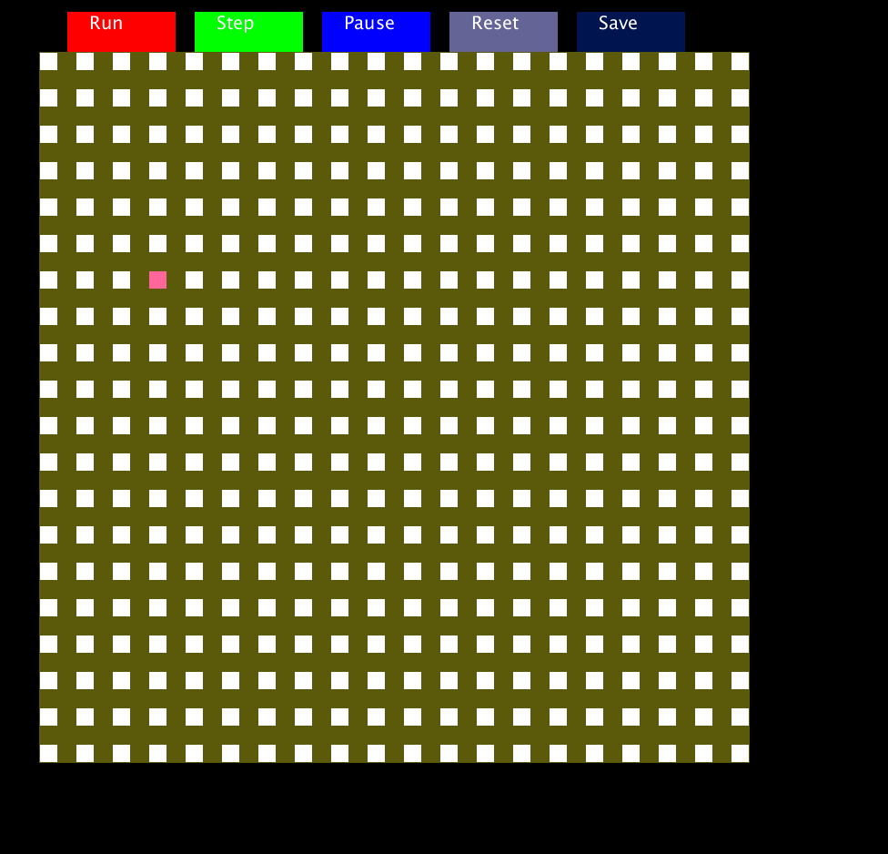

# MazeGenerator
A processing-based program that generates a 2D maze using recursive backtracking. 

### Process

The maze uses a recursive-backtracking algorithm to generate the maze. The general algorithm used can be found on the following websites: http://ozuduru.com/2016/02/10/recursive-backtracking-maze-generator-in-java-with-gui/. Note that in this implementation we randomly select the start cell of the algorithm.

Some things to note about the algorithm are that there be will exactly one path from any cell in the maze to any other cell. This could be changed by selecting random non-path
cells in the algorithm and converting them to path cells. This could help increase the complexity of the maze by introducing cycles into it.

### Instructions

In order to run the program you will need to download the processing IDE from https://processing.org/. To save a generated maze you will need to create a .txt file in advance and then select this file after clicking on the 'Save' button. ALl other instrcutions should be self explanatory.
